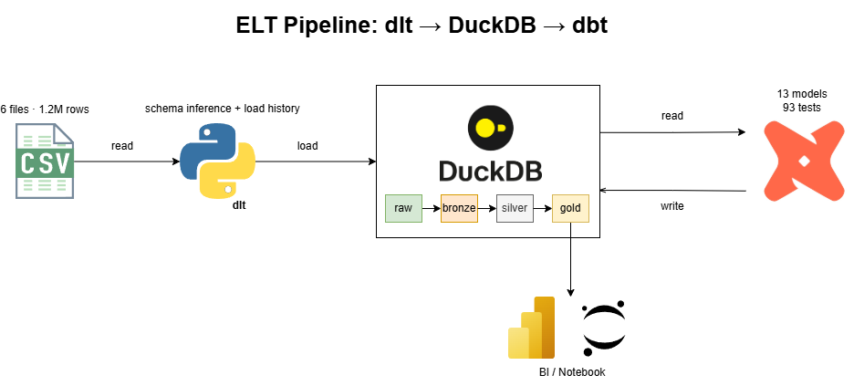
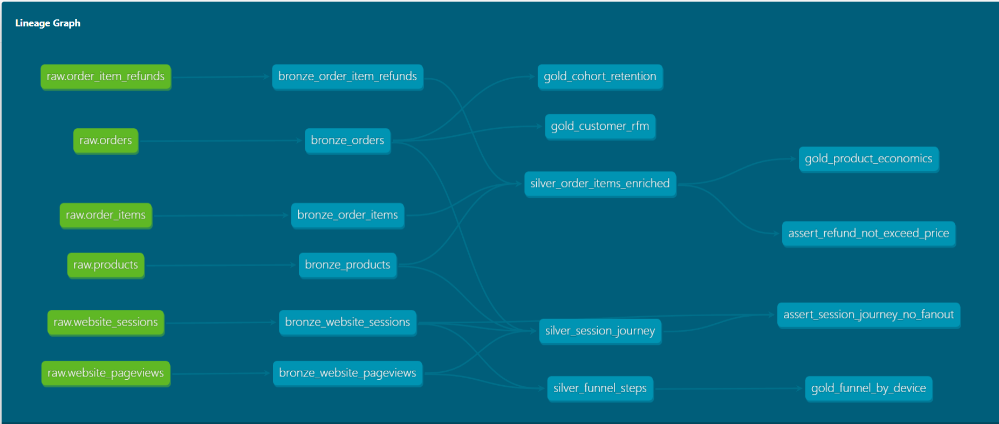

# 🏗️ SmartToys Analytics Engineering Pipeline — dlt, DuckDB & dbt

This repository turns an exploratory pandas analysis into a tested, reproducible data warehouse. It takes six raw CSV tables through ingestion, layered modeling, and 93 automated data tests.

🔗 **Companion analysis repo:** [smarttoys-ecommerce-analytics](https://github.com/duyngoduyngo/smarttoys-ecommerce-analytics)

---

## 🧰 Tech Stack

- **dlt (data load tool)** — Python ingestion framework. Infers schema automatically, records load history in `_dlt_loads`, and handles schema evolution.
- **DuckDB** — Embedded analytical database. Runs entirely in-process with no infrastructure to provision, and reads `.csv` and `.csv.gz` directly.
- **dbt Core 1.12** — SQL transformation framework. Modeling, testing, and documentation live in the same version-controlled project.
- **dbt Power User (VS Code)** — Development aid for inline lineage, model preview, and autocomplete.

No orchestrator is included. The source data is a static export, so adding Airflow would be decoration rather than a solution to a real problem.



---

## 📁 Project Structure

```
smarttoys-analytics-pipeline/
├── data/
│   └── raw/                        # 6 source CSV files (2 gzipped)
├── ingestion/
│   └── load_raw.py                 # dlt pipeline: CSV → DuckDB raw schema
├── images/
│   ├── project_architecture.png    # Architecture diagram
│   └── dbt_lineage.png             # dbt docs lineage graph
├── dbt_smarttoys/                  # dbt project
│   ├── models/
│   │   ├── bronze/                 # 6 models — type casting, cleaning
│   │   │   ├── _sources.yml        # Source declarations + 32 tests
│   │   │   └── _bronze.yml         # Model docs + 31 tests
│   │   ├── silver/                 # 3 models — business logic
│   │   │   └── _silver.yml         # Model docs + 14 tests
│   │   └── gold/                   # 4 models — reporting marts
│   │       └── _gold.yml           # Model docs + 14 tests
│   ├── tests/                      # 2 singular tests
│   │   ├── assert_refund_not_exceed_price.sql
│   │   └── assert_session_journey_no_fanout.sql
│   ├── dbt_project.yml
│   └── profiles.yml                # Kept in-repo so clones run without setup
├── .gitignore
├── README.md
└── requirements.txt
```

---

## 🔄 Architecture

```
data/raw/*.csv
     │
     │  dlt — ingestion/load_raw.py
     ▼
raw.*                  6 tables in DuckDB, with load history
     │
     │  dbt
     ▼
bronze_*   (6 views)   Cast timestamps, label null UTM traffic, normalise device_type
     ▼
silver_*   (3 views)   Business logic: enriched line items, session journey, funnel flags
     ▼
gold_*     (4 tables)  Marts that answer specific business questions
```

**Gold layer**

| Model | Question it answers |
|---|---|
| `gold_product_economics` | Which product is actually profitable after COGS and refunds? |
| `gold_funnel_by_device` | Where do customers drop off, and on which device? |
| `gold_cohort_retention` | Do customers come back? |
| `gold_customer_rfm` | Who are the high-value customers? |

`gold_cohort_retention` and `gold_customer_rfm` read directly from bronze rather than through silver. This is deliberate: their logic is used in exactly one place, so an intermediate silver model would be a layer that earns nothing.



---

## ⚙️ Setup Instructions

**1. Clone and create a virtual environment**

```bash
git clone https://github.com/duyngoduyngo/smarttoys-analytics-pipeline.git
cd smarttoys-analytics-pipeline

python -m venv .venv
.venv\Scripts\Activate.ps1      # Windows PowerShell
# source .venv/bin/activate     # macOS / Linux
```

**2. Install dependencies**

```bash
pip install -r requirements.txt
```

**3. Load raw data into DuckDB**

```bash
python ingestion/load_raw.py
```

Expected output — row counts must match the source analysis:

```
raw.orders                     32,313 rows
raw.order_items                40,025 rows
raw.order_item_refunds          1,731 rows
raw.products                        4 rows
raw.website_pageviews       1,188,124 rows
raw.website_sessions          472,871 rows
```

**4. Build models and run tests**

```bash
cd dbt_smarttoys
dbt debug          # verify connection
dbt build          # run 13 models + 93 tests
```

`dbt build` runs models and their tests in dependency order, so a failing test stops downstream models from being built on bad data.

**5. Generate documentation**

```bash
dbt docs generate
dbt docs serve --port 8081
```

`profiles.yml` lives inside `dbt_smarttoys/` rather than `~/.dbt/`, so anyone who clones this repo can run it without additional configuration.

---

## ✅ Data Quality

**93 tests run on every `dbt build`.**

| Layer | Tests | What they cover |
|---|---|---|
| Source | 32 | `unique`, `not_null`, `relationships`, `accepted_values` on raw tables |
| Bronze | 31 | Integrity **after** transformation, not just at the source |
| Silver | 14 | Fan-out prevention, business logic outcomes |
| Gold | 14 | Fields the reporting layer depends on |
| Singular | 2 | Custom business rules |

### Why these tests exist

This pipeline was built after the pandas analysis, not before it. Three data problems that had been handled **by hand** in the notebook became automated tests here:

| Problem | Notebook | This pipeline |
|---|---|---|
| Joining sessions to orders caused fan-out | A hand-written `assert len(journey) == n_sessions` | `unique` test on the key plus a singular test |
| One order item could have multiple refunds | Had to remember to `groupby` before merging | Logic lives in the model, guarded by a `unique` test |
| Foreign keys were never verified | A one-off `isin().mean()` block | 5 `relationships` tests on every build |

The difference is not sophistication. It is that in a notebook, forgetting a check produces no signal at all.

### Singular tests

**`assert_refund_not_exceed_price`** — a line item's refund cannot exceed its own sale price. A failure means either the source data is wrong or the refund aggregation has fanned out.

**`assert_session_journey_no_fanout`** — row count in `silver_session_journey` must equal the session count exactly. This is the same check that had to be asserted manually during the pandas analysis.

### A failure mode worth documenting

On an early build the log reported `PASS=54` and looked entirely healthy. In reality **16 tests never ran**. A `schema.yml` file had been truncated during a copy, so dbt could not match the tests to their models — and it logged a warning rather than raising an error.

This is dbt's most dangerous blind spot: **a test that does not exist does not fail, it simply does not run.** The habit adopted for the rest of this project was to check the `Found X data tests` count after every schema change and confirm it moved by the expected amount.

---

## 🔍 Cross-Validation Against the pandas Analysis

Every mart was checked against the corresponding figure in the original notebook. The two paths are fully independent — one computed with pandas, one with SQL.

| Metric | dbt | Notebook |
|---|---|---|
| Order item rows | 40,025 | 40,025 |
| Gross revenue | $1,938,509.75 | $1,938,509.75 |
| Net profit | $1,130,800.81 | $1,130,800.81 |
| Net margin | 58.33% | 58.33% |
| Desktop: sessions / orders / CR | 327,027 / 27,805 / 8.50% | identical |
| Mobile: sessions / orders / CR | 145,844 / 4,508 / 3.09% | identical |
| Mr. Fuzzy: margin / refund rate | 55.91% / 5.11% | identical |
| Hudson: margin / refund rate | 67.08% / 1.28% | identical |
| Panda: refund rate (highest) | 6.04% | identical |
| Billing → Order drop-off (Desktop / Mobile) | 36.41% / 45.92% | identical |
| Month-1 retention (mean) | 0.84% | identical |

All eleven metrics match exactly.

---

## ⚠️ Limitations & Next Steps

**Known limitations**

- **Small scale.** Four products and 1.19M pageview rows. Enough to demonstrate modeling and testing discipline, not a performance exercise.
- **Static data.** No incremental models or snapshots, because nothing changes over time to capture.
- **No orchestration.** Runs manually via `dbt build`.
- **RFM is constrained by the data.** The `frequency` column holds only three distinct values (1, 2, 3), so the F score resolves to three tiers rather than five. Segment names therefore reflect Recency and Monetary more than genuine loyalty.

**If extended**

- Replace the CSV source with CDC from a transactional database — incremental models and snapshots would then earn their place
- Add an orchestrator once multiple interdependent pipelines exist
- Deploy `dbt docs` to GitHub Pages for shareable documentation
- Add `dbt_utils` tests at the gold layer (`expression_is_true`, `equal_rowcount`)

---

## 📚 References

- [dbt Documentation](https://docs.getdbt.com/)
- [dlt Documentation](https://dlthub.com/docs/intro)
- [DuckDB Documentation](https://duckdb.org/docs/)

---

*Built by **Ngo Duc Duy** · [LinkedIn](https://www.linkedin.com/in/duyngoduyngo/) · duyngoduyngo@gmail.com*
